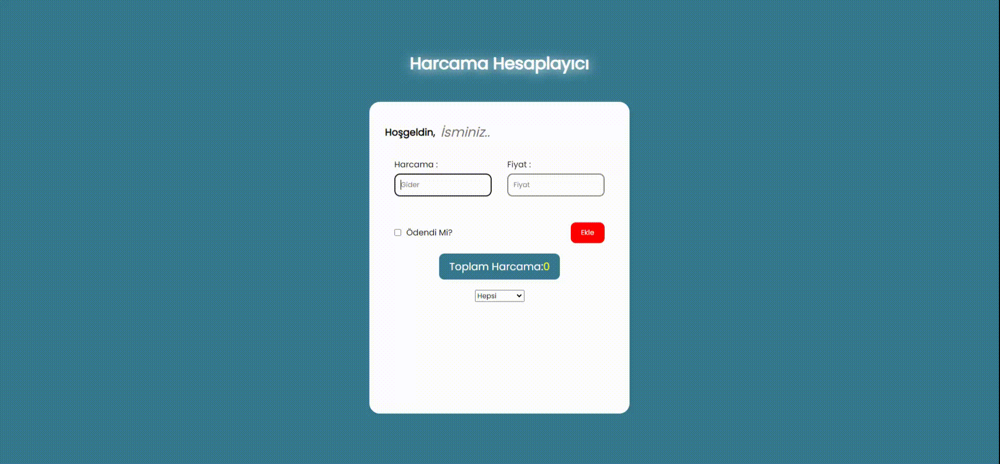

# spending-calculator
<h1> Harcama Hesaplayıcı</h1>

Bu proje, HTML, CSS ve JavaScript kullanılarak oluşturulan bir harcama hesaplayıcıdır. Kullanıcılar, harcamalarını listeye ekleyebilir, ödenen ve ödenmeyen harcamaları ayrı ayrı görüntüleyebilir, listeye eklenen ürünlerin fiyatlarını toplam olarak görebilir ve gerektiğinde listeden ürünleri kaldırabilirler.

<h1> EKRAN GÖRÜNÜMÜ</h1>

